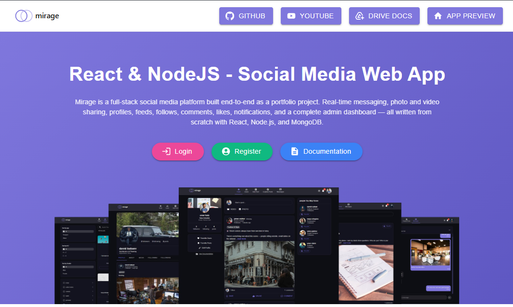
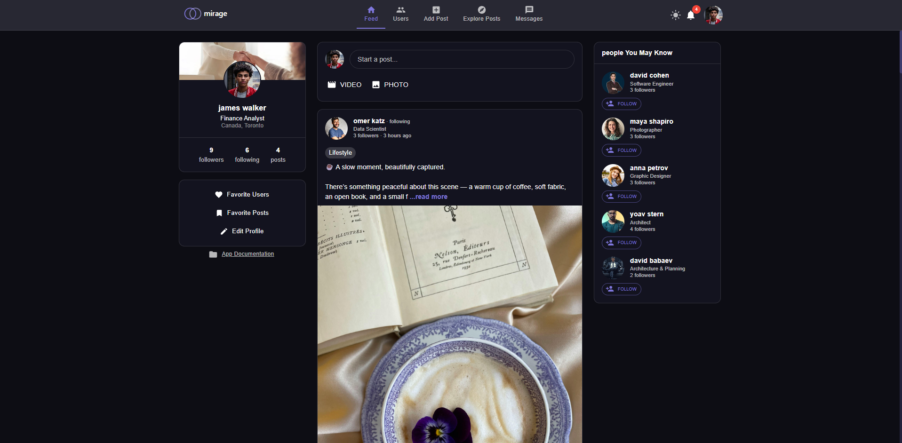
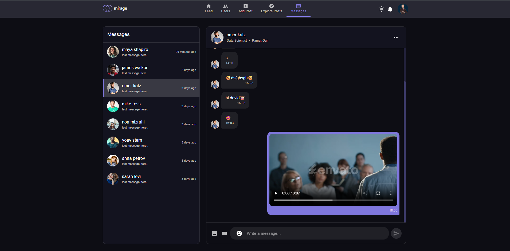
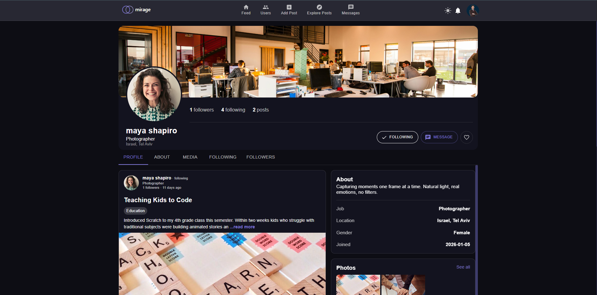
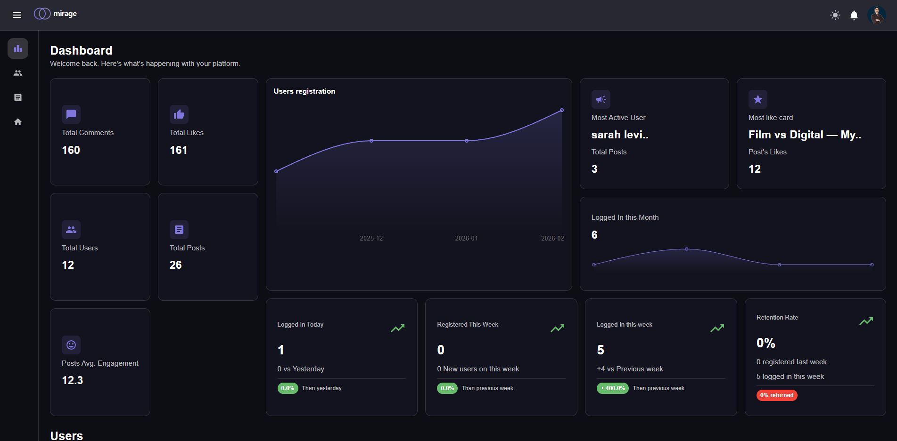
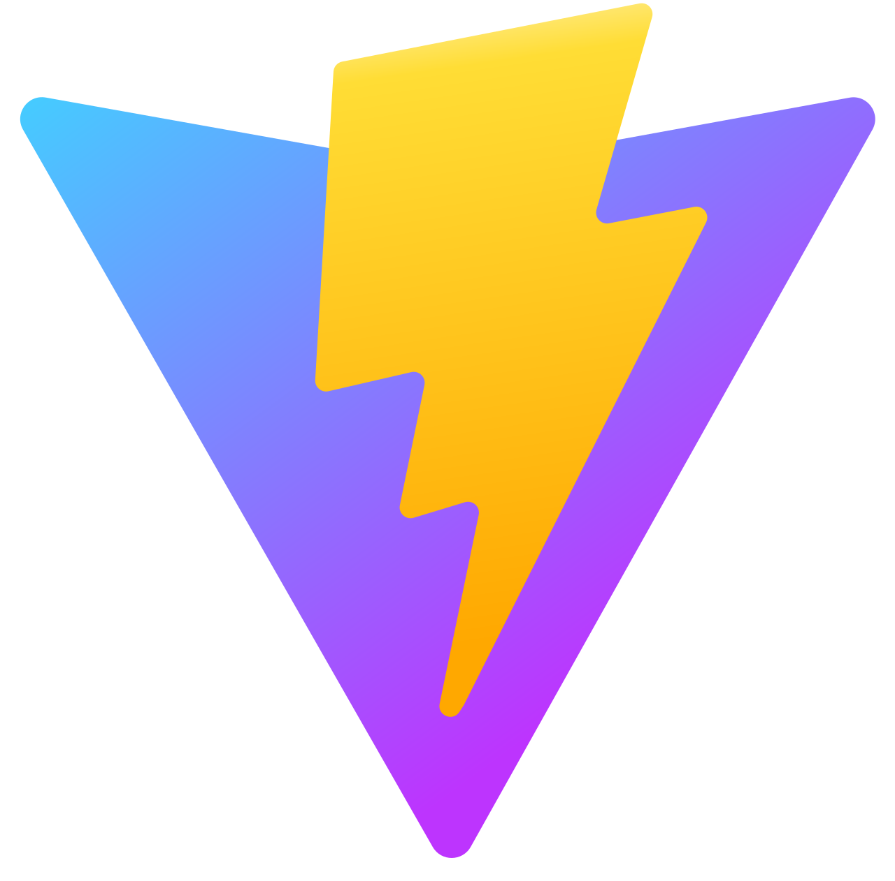
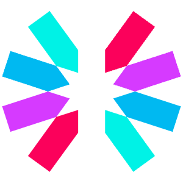

<div align="center">



# Mirage42

*Full-stack social media with real-time chat.*

[**Live Demo**](https://mirage42.com) · [**Documentation**](https://mirage42.com/docs) · [**LinkedIn**](https://www.linkedin.com/in/davidbabaev/) · [**YouTube Channel**](https://www.youtube.com/@david_kingdom)

</div>

---

## About

Mirage42 is a full-stack social media platform where people post, follow, comment, and chat in real time. It covers the full lifecycle of a modern social app — public profiles, a personalized feed, photo and video sharing, notifications, and direct messaging — plus a full admin dashboard for moderation and analytics.

Under the hood, the app runs on production-grade infrastructure: deployed at [mirage42.com](https://mirage42.com) on a custom domain, with separate production and development databases, real-time WebSocket messaging through Socket.IO, Cloudinary-backed media uploads, and JWT plus Google OAuth authentication.

The project was built solo, end-to-end — frontend, backend, database, deployment, and design — over eight months and ~1,200 hours of self-directed work.

## Key Features

- **Real-time chat** - bidirectional messaging via Socket.io, with image/video shring, an emoji picker, and a WhatsApp-style mobile layout
- **Personalized feed and social graph** - posts from people you follow, friends-of-friends suggestions, follow/unfollow, and provate favorites lists.
- **Full admin dashboard** - analytics on users, posts, retention, demographics, and engagement, plus moderation tables with ban / promote / delete actions.
- **Authntication** - email + password with JWT sessions, plus Google OAuth via Passport.js, with age verification and account profile editing. 
- **Media Handling** - image and video uploads (profile, cover, posts, chat) backed by Cloudinary.
- **Search, sort, filter, paginate** - across users and posts, with debounced search, multi-select category filter, and active-filter chips.
- **Light/dark theme + mobile-first design** - responsive layouts, portrait-orientation overlay for landscape phones, and an auto-hiding bottom nav on scroll.

> A complete feature list and premissions matrix lives in the [project documentation](https://mirage42/docs/features)

## Screenshots

### Feed
The home page after login. Posts from people you follow, "people you may know" suggestions in the right sidebar, and quick post creation up top



### Real-time chat
Websocket-backed massaging with image an video shring, an emoji picker, and a conversation list sorted by most recent activity.



### Public profile
A user's public with cover image, followers and following counts, a post grid, and a mutual-friends sidebar.



### Admin Dashboard
Full analytics over users, posts, retention, demographics, and engagement - plus moderation tables for users and posts.



## Teack Stack

### Frontend
<p>
    
    
    
</p>

### Backend
<p>
    
    
    
    
    
</p>

### Database & Services & Hosting
<p>
    
    
    
    
</p>

## Project Structure

Mirage42 is a monorepo. the frontend and backend share a single git history but deploy as two independent services.

```
mirage42/
├── frontend/                  React + Vite client
│   ├── public/
│   ├── src/
│   │   ├── App.jsx            top-level routes
│   │   ├── main.jsx           entry point
│   │   ├── components/        shared UI components
│   │   ├── pages/             route-level pages
│   │   ├── providers/         React Context (auth, cards, theme, users, UI)
│   │   ├── hooks/             custom hooks
│   │   ├── services/          REST + Socket.IO clients
│   │   ├── utils/             helpers
│   │   ├── constants/         shared constants
│   │   └── assets/            images and logos
│   ├── index.html
│   ├── package.json
│   └── vite.config.js
│
├── backend/                   Node.js + Express + Socket.IO
│   ├── src/
│   │   ├── app.js             Entry point: Express, Socket.IO, middleware
│   │   ├── dbService.js       MongoDB connection
│   │   ├── auth/              JWT + Google OAuth (Passport.js)
│   │   ├── cards/             Posts — feature folder with its own:
│   │   │   ├── models/        (Card schema)
│   │   │   ├── routes/        (REST endpoints)
│   │   │   ├── service/       (business logic)
│   │   │   ├── helpers/       (normalizers, validators)
│   │   │   └── validation/    (Joi schemas)
│   │   ├── chat/              Real-time chat (same pattern + Socket.IO handlers)
│   │   ├── notifications/     Notifications (same pattern)
│   │   ├── users/             Users (same pattern)
│   │   ├── middlewares/       CORS, Multer (file uploads)
│   │   ├── router/            Combines all feature routers
│   │   ├── seed/              Database seeding script
│   │   └── utils/             Cloudinary upload, error handling
│   └── package.json
│
├── docs/                      README assets
│   ├── banner.png
│   ├── screenshots/
│   └── logos/
│
└── README.md
```

**`frontend/`** - React 18, Vite, MUI. Pages, components, React contexts for global state (auth, posts, theme, users), custom hooks, and the API + socket service layer.

**`backend/`** - Node.js, Express, Mongoose. Organized by **feature**, not by MVC layer: each featur folder (`notifications`, `chat`, `users`, `cards`) contains its own models, routes, service, helpers, and validation. Real-time chat is handled through Socket.IO event handlers running alongside the REST routes. Authentication uses Passport.js fro Google OAuth, plus JWT for session tokens.